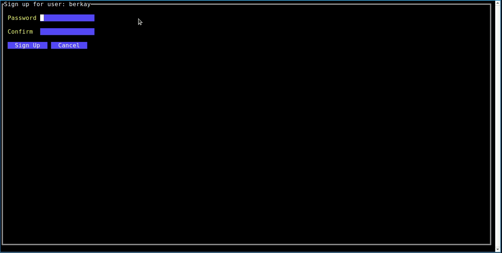

# sshman

A simple terminal UI for managing SSH sessions

sshman uses your unix current user and it creates an account for you. All account and session infos are stored in sqlite located at `$HOME/.sshman`. I tried to make it safe as possible as I can. Account passwords are stored as hashed and SSH session passwords are stored as encrypted by using your account password as key.

[//]: # (## sign-up screen)

[//]: # (![signup]&#40;assets/signup.png&#41;)

[//]: # (If your username is not found on DB. This screen meets you to assign your password. This password is important because you will be ask for your password to login.)

[//]: # ()
[//]: # ()
[//]: # (## log-in screen)

[//]: # (![login]&#40;assets/login.png&#41;)

[//]: # (When you sign-up successfully or execute sshman again, you will be met by this simple screen and you will be asked for your password.)

[//]: # ()
[//]: # (## main screen)

[//]: # (![main0]&#40;assets/main0.png&#41;)

[//]: # (After succesfull sign-in, you should see main screen. This screen consist of two part `Actions` and `Saved Sessions`. There are 4 actions:)

[//]: # (- **New Connection**: It opens new screen to save SSH connection)

[//]: # (- **Connect**: It makes you choose a session in next section. After choosing a session, you will be immediately connected to remote machine.)

[//]: # (- **Delete**: It makes you choose a session in nextion to delete.)

[//]: # (- **Quit**: no comment :&#41;)

[//]: # ()
[//]: # (## new connection screen)

[//]: # (![newconn]&#40;assets/newconn.png&#41;)

[//]: # ()
[//]: # (## other screenshots)

[//]: # (![main1]&#40;assets/main1.png&#41;)

## install
### with go
> $ go install github.com/bakyazi/sshman 

### with source code
> $ git clone https://github.com/bakyazi/sshman \
> $ cd sshman \
> $ go mod download \
> $ go run *.go

### with docker
> $ git clone https://github.com/bakyazi/sshman \
> $ cd sshman \
> $ docker build -t sshman . \
> $ ./rundocker.sh

## demo

## dependencies
ui: [this](https://github.com/rivo/tview)

ssh-client: [this](github.com/nanobox-io/golang-ssh)

DB/sqlite: [this](https://gorm.io/)

## roadmap
- [ ] grouping sessions
- [X] ssh key option (current just username&password)
- [ ] maybe more fancy modals for login/signup/new connection screens
